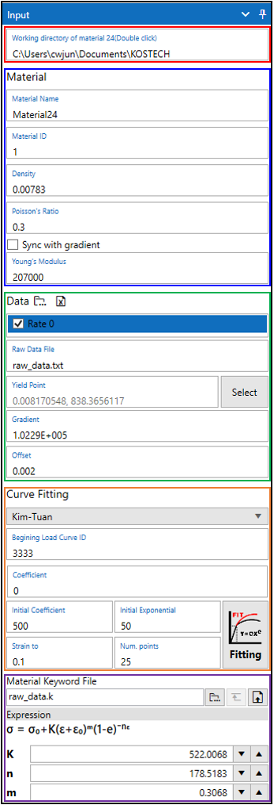

# 재료 물성 카드 생성

## 1. Steel 물성 카드 생성
LAMP에서 Steel 물성 카드 생성은 LS-Dyna의 *MAT_PIECEWISE_LINEAR_PLASTICITY(MAT_024) 카드를 생성하는 기능입니다. 해당 기능에서는 MAT_024 카드에 삽입되는 Load curve를 생성하고 LS-Dyna에서 사용가능한 키워드 파일 생성 및 출력을 위한 기능입니다. Load curve는 재료의 시편 인장 시험에서 얻은 raw data를 strain-stress plastic curve를 fitting으로 생성합니다.

### 1.1 입력 패널 UI
LAMP의 상단 아이콘 메뉴에서  아이콘을 클릭하면 입력 패널 UI가 우측에 표시됩니다.

{align=center}

{.border-red}
### 1.2 Working directory
Working directory는 Curve Fitting으로 생성되는 데이터가 저장되는 경로를 지정합니다.
:::{admonition} Selection of working directory
:class: tip
`Working directory` 선택은 입력란을 더블 클릭 하여 선택할 수 있습니다.
:::

### 1.3 Material property
MAT_024 카드에 입력될 재료 물성 값을 입력합니다.
:::{admonition} Sync with gradient
:class: tip
`Sync with gradient`를 체크하면 항복점 선택 시 정의되는 elastic line의 기울기 값으로 입력됩니다.
:::

### 1.4 Setup raw data
시편 인장 시험 데이터를 불러오고 항복점을 선택합니다.

Load raw data
: 시험 데이터를 가져오기 위해서  아이콘을 클릭하고 시험 데이터가 작성된 파일을 선택합니다. \
  지원되는 파일 형식은 다음과 같습니다. \

  - *.txt : 데이터의 각 열은 tab으로 구분되어야 합니다.
  - *.csv : 데이터의 각 열이 ,로 구분된 파일입니다.
  - *.xlsx : 일반적으로 엑셀(Excel)에서 사용되는 파일 형식입니다. 

 {align=center}