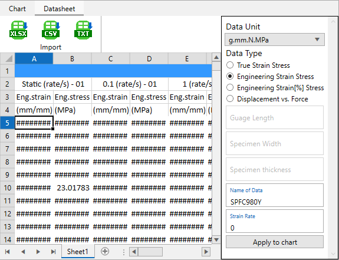
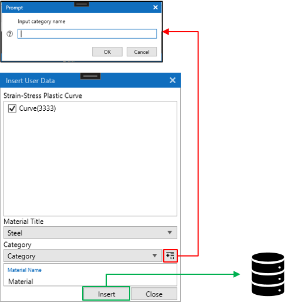

# 재료 물성 카드 생성

## 1. Steel 물성 카드 생성
LAMP에서 Steel 물성 카드 생성은 LS-Dyna의 *MAT_PIECEWISE_LINEAR_PLASTICITY(MAT_024) 카드를 생성하는 기능입니다. 해당 기능에서는 MAT_024 카드에 삽입되는 Load curve를 생성하고 LS-Dyna에서 사용가능한 키워드 파일 생성 및 출력을 위한 기능입니다. Load curve는 재료의 시편 인장 시험에서 얻은 raw data를 strain-stress plastic curve를 fitting으로 생성합니다.

### 1.1 입력 패널 UI
LAMP의 상단 아이콘 메뉴에서  아이콘을 클릭하면 입력 패널 UI가 우측에 표시됩니다.

{align=center}

### 1.2 Working directory
Working directory는 Curve Fitting으로 생성되는 데이터가 저장되는 경로를 지정합니다.
:::{admonition} Selection of working directory
:class: tip
`Working directory` 선택은 입력란을 더블 클릭 하여 선택할 수 있습니다.
:::

### 1.3 Material property
MAT_024 카드에 입력될 재료 물성 값을 입력합니다.
:::{admonition} Sync with gradient
:class: tip
`Sync with gradient`를 체크하면 항복점 선택 시 정의되는 elastic line의 기울기 값으로 입력됩니다.
:::

### 1.4 Setup raw data
시편 인장 시험 데이터를 불러오고 항복점을 선택합니다.

Load raw data
: 시험 데이터를 가져오기 위해서  아이콘을 클릭하고 시험 데이터가 작성된 파일을 선택합니다. \
  지원되는 파일 형식은 다음과 같습니다.

  - *.txt : 데이터의 각 열은 tab으로 구분되어야 합니다.
  - *.csv : 데이터의 각 열이 ,로 구분된 파일입니다.
  - *.xlsx : 일반적으로 엑셀(Excel)에서 사용되는 파일 형식입니다. 
 
 {align=center}

 Selection of data
 : 가져올 strain-stress 데이터를 블록 선택한 후에 Data Type을 선택하고 필요에 따라 `Name of Data`를 변경합니다. \
   만약에 선택한 데이터가 strain rate를 가진다면 `Strain Rate`를 입력합니다. \
   모든 입력을 마친 후에 `Apply to chart` 버튼을 클릭합니다.

 :::{caution}
 가져오는 strain-stress 데이터의 각 열은 반드시 서로 인접해야 합니다.
 :::

 :::{admonition} Selection of Data Unit
 선택한 데이터의 단위계를 선택합니다. 선택한 데이터의 단위는 g.mm.N.MPa 단위로 변환되어 표시됩니다. \
 LAMP에서 지원하는 [전역 단위계 변환]()을 통해 실제 출력되는 데이터의 단위를 설정할 수 있습니다.
 :::

 :::{admonition} Selection of Data Type
 Curve fitting은 Engineering strain-stress를 사용하여 수행되기 때문에 선택한 데이터는 Engineering strain-stress로 변환됩니다. 변환을 위해서 선택한 데이터가 어떤 형태의 데이터인지를 알아야 하기에 Data Type을 선택합니다.

 - True Strain Stress : 선택한 데이터가 True Strain Stress(진응력)일 경우 선택합니다.
 - Engineering Strain Stress : 선택한 데이터가 Engineering Strain Stress(공칭응력)일 경우 선택합니다.
 - Engineering Strain[%] Stress : 선택한 데이터가 Engineering Strain Stress이면서 Strain이 %단위일 경우 선택합니다.
 - Displacement vs. Force : 선택한 데이터가 Displacement-Force일 경우 선택합니다.

 :::{attention}
 Displacement vs. Force일 경우 Engineering Strain Stress로 변환하기 위해 시편의 Guage Length, Specimen Width, Specimen thickness가 필요합니다. 활성화 되는 아래 입력란에 입력할 수 있습니다.
 :::

 :::{tip}
 2개 이상의 시험 데이터를 가져와 일괄적으로 Curve fitting을 할 수 있습니다. 만약 각각의 데이터가 다른 strain rate를 가진다면 `Strain Rate` 항목을 입력하는 것을 권장드립니다.
 :::

 :::

Selection of yield point
: 위 그림에서 `Chart` 탭을 클릭하게 되면 `Apply to chart`를 통해 가져온 데이터 curve를 확인할 수 있습니다. 소성영역에 해당하는 strain-stress curve의 fitting을 위해서 항복점을 정의해야 합니다. 항복점의 선택은 `Select` 버튼으로 할 수 있습니다.

- `Select` 버튼 클릭
- 마우스를 Chart로 이동하면 선택 도구가 생성
- 커브에서 항복점을 선택
- 필요에 따라 `Offset`을 입력

### 1.5 Generation of plastic strain-stress curve
1.4에서 항목점을 결정하였다면 제공되는 경도 모델을 이용하여 Curve fitting을 통해 plastic strain-stress curve를 생성할 수 있습니다. LAMP에서 제공되는 경도 모델은 다음과 같습니다.

- Min-Max Average
- Voce
- Swift
- Ludwick
- KIm-Tuan Hardening Model
- Mixed Swift-Voce

사용하고자 하는 경도 모델을 선택하고 필요에 따라 다음의 입력 값들을 수정합니다.

- Begining Load Curve ID : 생성된 curve가 *DEFINE_CURVE로 정의 될때의 LCID입니다. 만약 2개 이상의 raw 데이터를 일괄적으로 fitting한다면 1씩 증가하면서 각 curve의 ID로 할당됩니다.
- Coefficient : **Coefficient 값은 현재 사용되지 않습니다. 추후 삭제될 예정입니다.**
- Initial Coefficient : Curve fitting에서 각 경도 모델의 계수 및 지수 값을 결정하게 되는데 Inital Coefficient는 계수 값의 초기값입니다.
- Initial Exponential : 경도 모델의 지수 값의 초기값입니다.
- Strain to : Curve fitting으로 생성되는 curve의 strain의 범위를 입력합니다.
- Num. points : Curve fitting으로 생성되는 curve의 point의 수를 입력합니다.
:::{tip}
Curve fitting으로 생성된 curve가 잘못된 형태를 가질 경우가 있을 수 있습니다. \
이럴 경우`Initial Coefficient`와 `Initial Exponential`을 조절하여 curve fitting을 다시 시도해 볼 수 있습니다.
:::
:::{tip}
`Strain to`를 0.1, `Num. points`를 25 입력시 0~0.1 strain 범위의 25개 점으로 curve가 생성됩니다.
:::

### 1.6 Determination of result
Curve fitting이 성공적으로 수행되면 기본적으로 `Working directory`에 `Raw Data File` 입력란에 입력된 이름으로한 키워드 파일이 생성됩니다. 생성된 키워드 파일에는 *MAT_PIECEWISE_LINEAR_PLASTICITY 카드와 *DEFINE_CURVE가 포함되며 사용된 경도 모델의 수식과 fitting으로 결정된 변수들의 값을 확인할 수 있습니다. 만약 결정된 계수값들에 대해서 fitting된 결과가 만족스럽지 못하다면 상하 방향의 화살표 아이콘을 통해서 각 계수를 값을 변경하면서 curve를 직접 수정할 수 있습니다. 또한 생성된 키워드 파일의 저장 경로로의 이동 및 데이터베이스에 저장을 할 수 있으며 해당 내용은 아래 Tip 항목을 확인하시기 바랍니다.

{.border-black}

:::{admonition} Move the directory
:class: tip
 아이콘으로 저장 경로로 이동 할 수 있습니다.
:::

:::{admonition} Move the directory
:class: tip
 아이콘으로 생성된 데이터를 데이터베이스에 저장할 수 있습니다. 아이콘을 클릭하면 `Insert User Data` 창이 표시되며, Curve fitting으로 생성된 curve들의 목록이 표시되며 데이터베이스에 저장하고자 하는 curve를 체크합니다. Category를 선택합니다. Category는  아이콘으로 추가할 수 있습니다. `Material Name`에 이름을 입력하고 `Insert` 버튼으로 데이터베이스에 데이터를 저장합니다.

:::{tip}
데이터베이스에 저장되는 데이터는 모두 `Category`라는 항목 아래에 입력된 `Material Name`으로 저장됩니다. 
:::

:::
