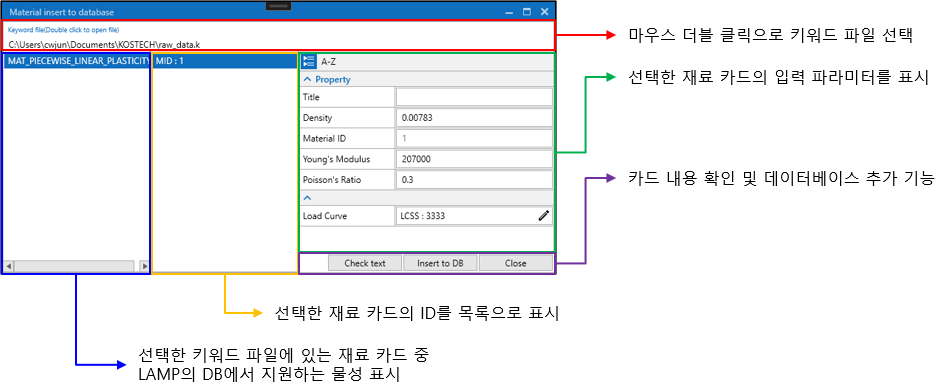

# 데이터베이스 물성 추가

## 1. 기능 소개
LS-Dyna 키워드 파일에 정의되어 있는 Material 카드 정보를 데이터베이스에 저장할 수 있는 기능으로 현재 추가할 수 있는 물성 카드는 다음과 같습니다. 

- *MAT_PIECEWISE_LINEAR_PLASTICITY

### 1.1 입력 패널 UI
LAMP의 상단 아이콘 메뉴에서  아이콘을 클릭합니다.

### 1.2 물성 추가하기

* 키워드 파일 불러오기
    * Keyword file(Double click to open file) 입력란에서 마우스로 더블 클릭합니다.
    * LS-Dyna 키워드 파일을 선택합니다.
    * 불러온 키워드 파일에서 지원되는 물성 카드를 찾아 목록으로 표시합니다.
* 추가할 물성 선택
    * 좌측 첫번째(파란색 테두리)에서 DB에 추가할 물성을 선택합니다.
    * 가운데(노란색 테두리)에 선택한 물성 카드의 ID들이 표시되며 추가할 ID 항목을 선택합니다.
    * 우측 첫번째(녹색 테두리)에서 선택한 물성의 정보를 확인합니다.
    * Check text 버튼을 통해 선택된 물성 카드를 텍스트로 확인 할 수 있습니다.
* 데이터베이스에 추가
    * Insert to DB를 클릭합니다.
    * 아래 그림의 Insert User Data 창이 표시되며 물성 카드에 커브 데이터가 있다면 Curve ID가 표시됩니다.
    * 재료 데이터는 카테고리 항목 아래에 저장되기에 Category를 선택합니다. 로 추가 할 수 있습니다.
    * 물성 이름(Material Name)을 입력하고 Insert를 눌러 DB에 데이터를 저장합니다.

### 1.3 DB에서 저장된 데이터 확인
데이터베이스에 저장된 데이터 확인 및 출력은 [데이터베이스](start_lamp.md) 항목에서 확인할 수 있습니다.

