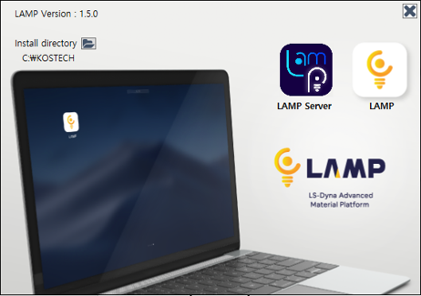

# 시작하기
- [목록]()
  - [1. Introduction](#1-Introduction)
  - [2. Installation](#2-Installation)

## 1. Introduction
LAMP(LS-Dyna Advanced Material Platform)는 한국시뮬레이션기술에서 개발하고 있는 프로그램으로 LS-Dyna 사용자들이 재료 물성 카드를 생성 및 관리할 수 있도록 다양한 기능들을 제공하여 LS-Dyna 해석 소프트웨어 활용에 편의성을 제공합니다. LAMP는 현재 한국시뮬레이션기술에서 LS-Dyna를 구매하고 유지보수를 유지하고 계시는 고객들에게 제공되고 있으며, 설치 및 사용과 관련한 문의는 support@kostech.co.kr로 연락주시기 바랍니다.
## 2. Installation
LAMP 설치를 위해 압축파일이 제공되며, 압축 해제 후 LAMP Installer.exe 파일을 실행하면 아래와 같은 설치 화면이 표시됩니다.

- 경로 변경 : 설치 경로는 Install directory 우측 아이콘을  클릭 하여 변경 할 수 있습니다.