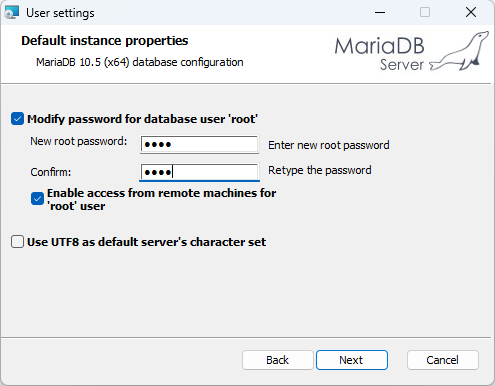

# 시작하기

## 1. Introduction
LAMP(LS-Dyna Advanced Material Platform)는 한국시뮬레이션기술에서 개발하고 있는 프로그램으로 LS-Dyna 사용자들이 재료 물성 카드를 생성 및 관리할 수 있도록 다양한 기능들을 제공하여 LS-Dyna 해석 소프트웨어 활용에 편의성을 제공합니다. LAMP는 현재 한국시뮬레이션기술에서 LS-Dyna를 구매하고 유지보수를 유지하고 계시는 고객들에게 제공되고 있습니다.
## 2. Installation
LAMP 설치를 위해 압축파일이 제공되며, 압축 해제 후 LAMP Installer.exe 파일을 실행하면 아래와 같은 설치 화면이 표시됩니다.

### 2.1 경로 변경 
설치 경로는 Install directory 우측 아이콘을  클릭 하여 변경 할 수 있습니다.
### 2.2 LAMP Server 설치 
LAMP에서 제공하고 데이터베이스 및 네트워크 라이선스를 관리 할 수 있는 프로그램으로 데이터베이스 및 네트워크 라이선스를 관리 할 장비에 설치합니다. 
### 2.3 LAMP 설치 
사용자 PC에 LAMP를 설치합니다.

## 3. License 발급
LAMP 설치 이후에 LAMP를 사용하기 위해서는 한국시뮬레이션기술에서 라이선스를 제공받으셔야 합니다. 현재 LAMP 개발 진행중인 소프트웨어로 한국시뮬레이션에서 LS-Dyna를 구매하고 유지보수를 유지하고 계시는 고객들에게 2개월동안 사용가능한 라이선스가 발급됩니다. 로컬 PC 1대에 사용가능한 stand-alone license와 서버 PC 1대에 license를 위치 시키고 1대 이상의 client PC에서 사용가능한 network license를 사용할 수 있습니다. 라이선스 발급은 라이선스 파일이 위치할 PC의 로그 정보를 한국시뮬레이션기술에 제공해주시면 해당 PC에 대한 라이선스를 발급해드립니다.
### 3.1 Stand-alone license
개인 local PC 1대에 LAMP를 사용하기 위한 라이선스로 LAMP 설치 시 함께 설치되는 LicenseManager에서 로그 파일을 생성 할 수 있으며, 발급되는 라이선스를 등록할 수 있습니다. 

#### 로그 파일 생성
LicenseManager를 실행하고 상단 Export 메뉴에서 Log file 메뉴를 클릭하면 생성되는 창에서 요구되는 정보를 입력하고 Save log file 버튼으로 log 파일을 저장 후 한국시뮬레이션기술에 로그 파일을 보냅니다.

#### 라이선스 파일 등록
제공되는 라이선스 파일은 LicenseManager에서 등록을 해야 합니다. LicenseManager를 실행 하시고 License Type을 Stand-alone으로 선택합니다. License Path의 Browse를 클릭한 후 제공된 라이선스 파일을 선택하고 Apply를 눌러 라이선스를 등록합니다.

### 3.2 Network license
#### 로그 파일 생성 (서버 PC)
네트워크 라이선스를 발급받기 위해서는 LAMP Server에서 로그 파일을 생성해야 합니다. 

- LAMP Server를 실행하고  아이콘을 클릭
- Generate log 버튼 클릭
- 필수 정보 입력 후 Save log file 클릭

#### 라이선스 파일 등록 (서버 PC)
제공되는 라이선스는 서버 PC에서 LAMP Server를 통해 등록합니다.

- LAMP Server를 실행하고  아이콘을 클릭
- Registration 버튼 클릭 후 제공된 라이선스 파일 선택

#### 라이선스 등록 (클라이언트 PC)
서버에 등록된 라이선스를 클라이언트 PC에서 사용하기 위해서 LicenseManager를 통해 등록합니다.

- LicenseManager를 실행
- License Type을 Network로 선택하고 서버의 IP Address를 입력 후 Apply 클릭

## 4. 데이터베이스 설정
LAMP에서 제공하는 데이터베이스는 MariaDB에서 테스트 되었으며, 사용을 위해 서버 PC에 MariaDB를 설치 해야 합니다. 
### 4.1 MariaDB 설치
설치를 위해 아래 경로에서 다운로드 받고 설치 합니다. MariaDB 설치 과정에서 root 사용자에 대한 비번을 입력 하고 'Enable access from remote machines for 'root' user에 체크 합니다.

<https://dlm.mariadb.com/1913768/mariadb/mariadb-10.5.13/winx64-packages/mariadb-10.5.13-winx64.msi>

### 4.2 현대제철 물성 추가
LAMP는 현대제철의 Steel 계열의 물성을 제공합니다. 현대제철 물성을 사용하기 위해서는 제공되는 현대제철 물성을 데이터베이스에 추가하여야 합니다.

- LAMP Server 실행 후  아이콘 클릭
- DB Connect 클릭 후 사용자 계정(root)과 비밀번호를 입력 하고 Connect 클릭
- 연결 성공 시 File Load 버튼 활성화 되며 File Load 버튼 클릭하고 hyundaisteel_db.sql 파일 선택 
- hyundaisteel_db.sql 파일은 LAMP Server 설치 경로의 data 폴더에 있음
- hyundaisteel_db 데이터 추가 후 Load 열의 버튼을 눌러 Load 진행
- Status 열이 Loaded로 변경되면 성공

## 5. LAMP 메인 User Interface

